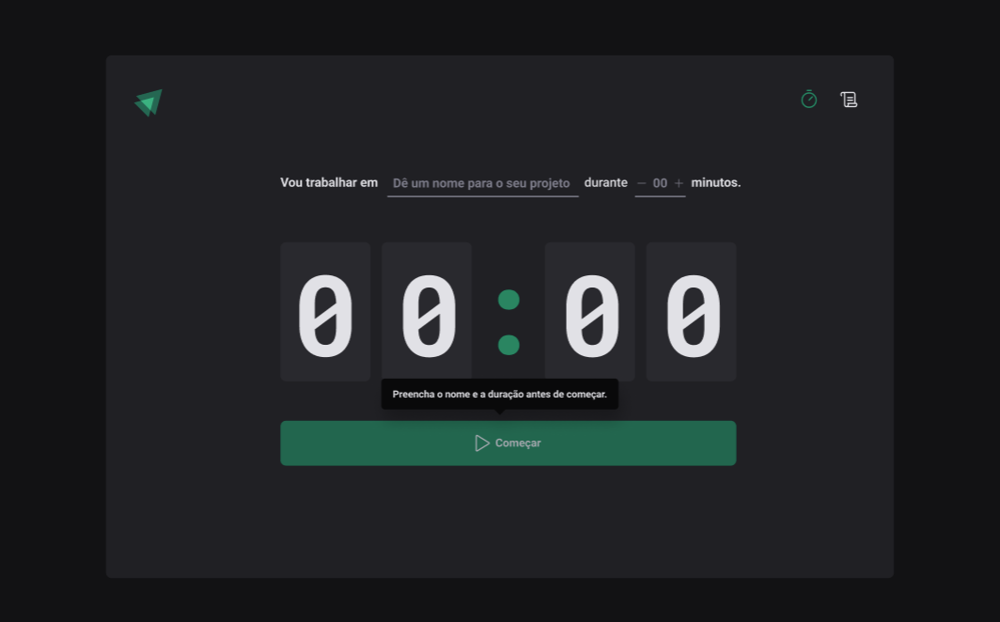

# Ignite Timer 

Projeto contador pomodoro  
> Para ver o projeto rodando você pode acessar este [Link](link.com.br).

---

Aplicação WEB:

  

---
## Funcionalidades

- [x] 

---

## Tecnologias

- [`React`](https://pt-br.reactjs.org/)
- [`Typescript`](https://www.typescriptlang.org/docs/)
- [`Styled-components`](https://styled-components.com/)
- [`React-router`](https://reactrouter.com/en/main)
