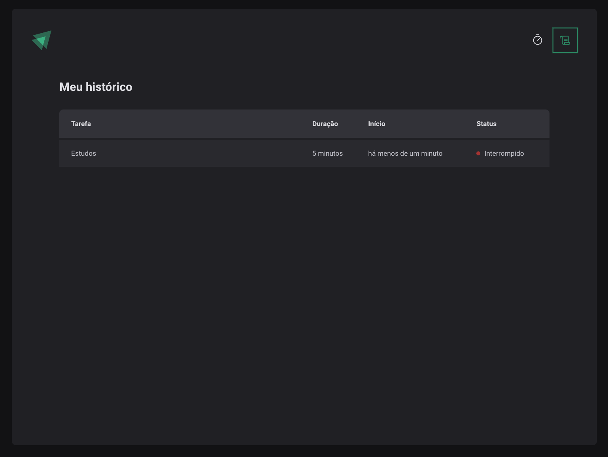

# Ignite Timer 

O projeto do Contador Pomodoro é uma aplicação simples e eficiente desenvolvida para ajudar as pessoas a aumentarem sua produtividade e gerenciarem melhor o tempo.  
> Para ver o projeto rodando você pode acessar este [Link](https://ignite-timer-delta-ashen.vercel.app/).

---

Aplicação WEB:

  
  
  

---
## Funcionalidades

- [x] Novo ciclo  
- [x] Cancelar ciclo  
- [x] Histórico de ciclos  

---

## Tecnologias

- [`React`](https://pt-br.reactjs.org/)
- [`Typescript`](https://www.typescriptlang.org/docs/)
- [`Styled-components`](https://styled-components.com/)
- [`React-router`](https://reactrouter.com/en/main)
- [`React Hook Form`](https://react-hook-form.com/)
- [`zod`](https://zod.dev/)
- [`immer`](hhttps://immerjs.github.io/immer/)
